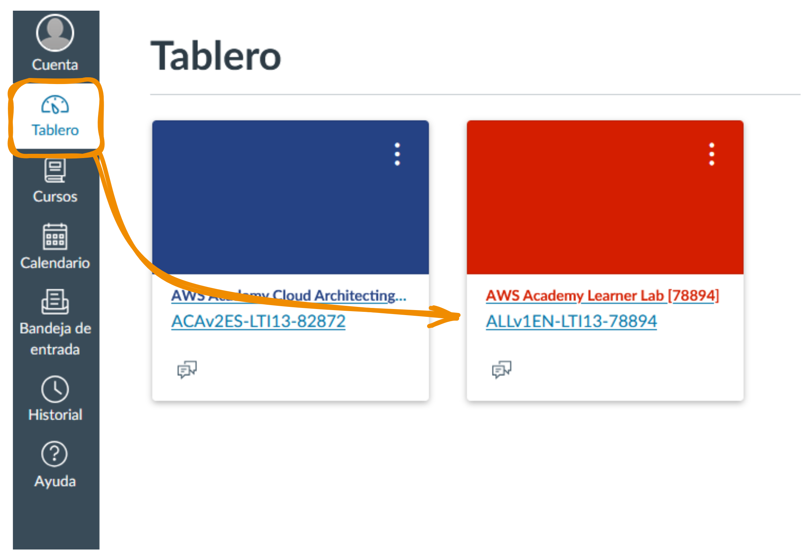
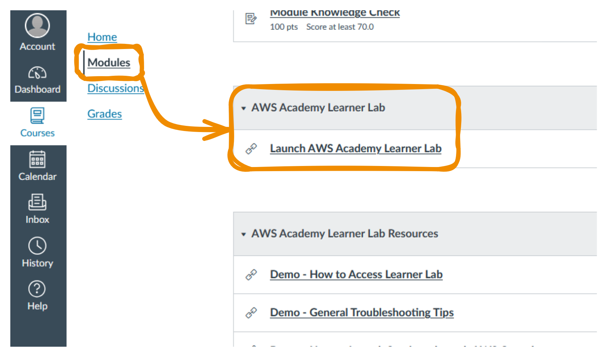
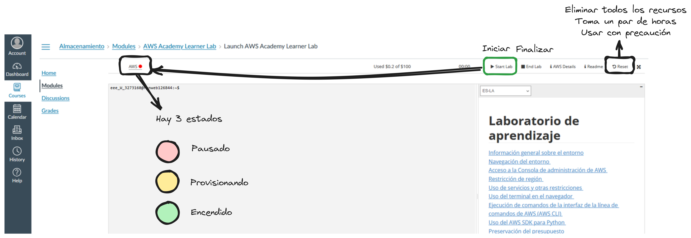
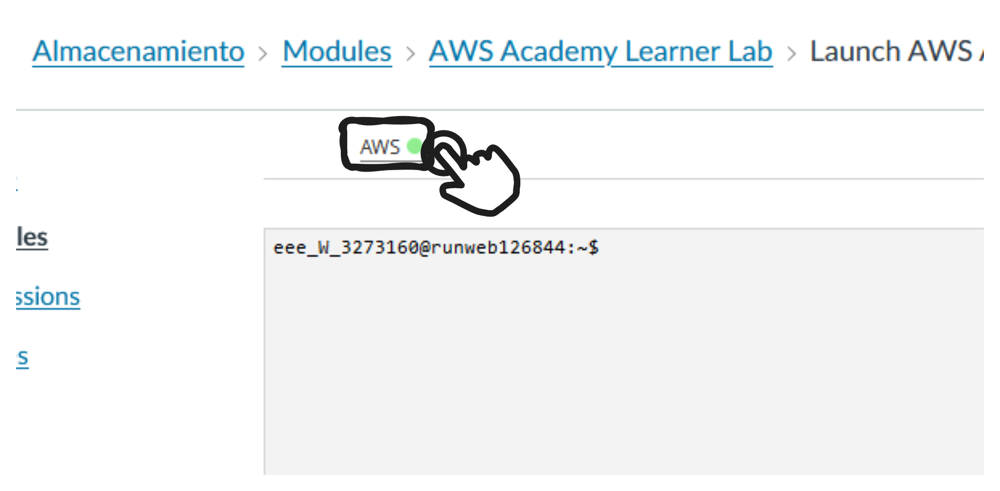
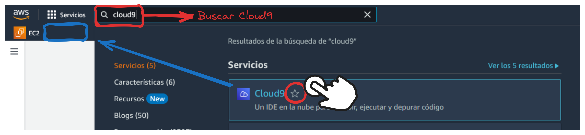
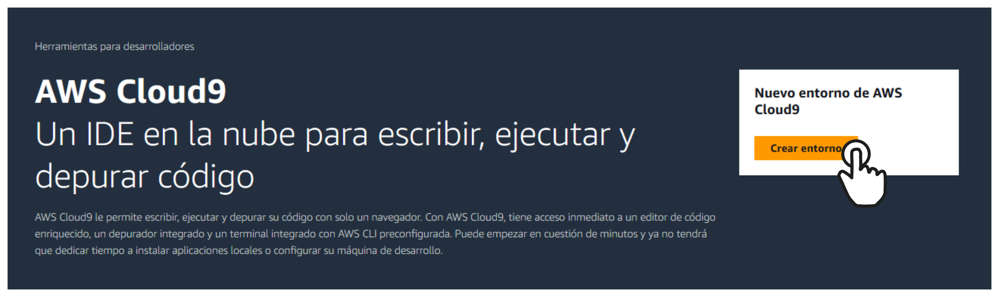
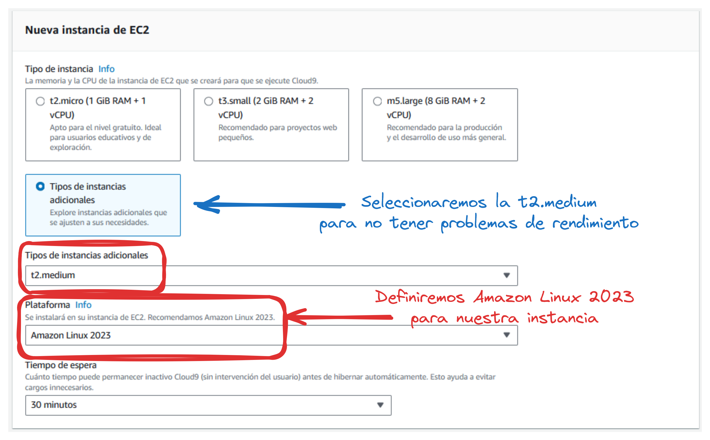
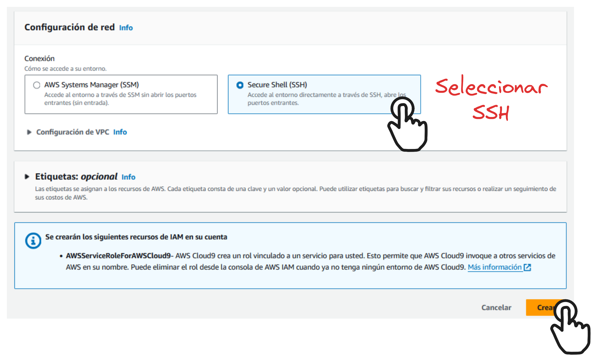
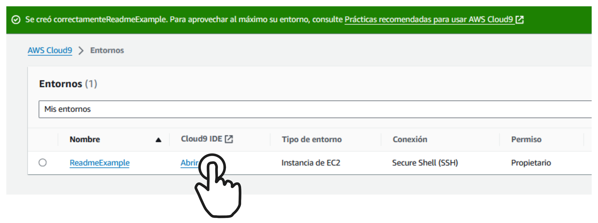
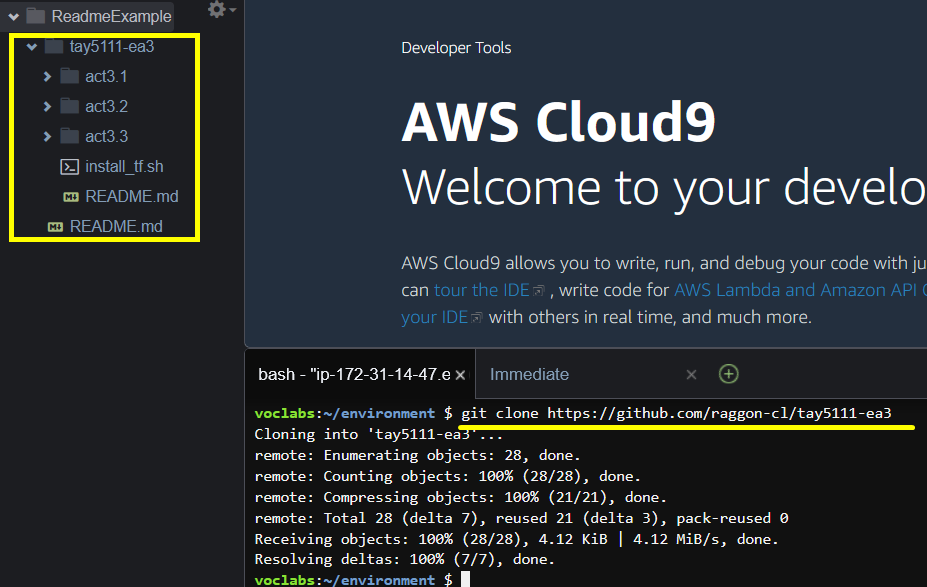

# tay5111-ea3

## [Documentación de Terraform con AWS aquí](https://registry.terraform.io/providers/hashicorp/aws/latest/docs)

# Logear en AWS ☁️
1. [URL Para logear en AWS Academy](https://awsacademy.instructure.com/)
2. Apretas en el botón que dice Student login e ingresas tus credenciales

# Instanciar ambiente para desarrollo y ejecución de Terraform
1. Una vez en el Home, buscar la sección ```Tablero``` en la barra de la izquierda y luego seleccionar el curso ```AWS Academy Learner Lab [78894]```
2. 
3. 
4. 
5. Click en ```AWS``` Para ir al portal una vez esté disponible (en verde)
6. Buscar ```Cloud9``` en el buscador, seleccionar la estrella para marcarlo como favorito y luego apretar en Cloud9 
7. Crearemos un nuevo entorno para el desarrollo de nuestras actividades 
8. Le asignaremos un nombre y seleccionaremos la opción ```Nueva instancia de EC2```
9.  Seleccionaremos ```Tipos de instancias adicionales``` y luego seleccionaremos ```t2.medium``` y ```Amazon Linux 2023```
10. Seleccionaremos la opción ```Secure Shell (SSH)``` y le daremos a ```Crear```
11. Seleccionaremos ```abrir``` Para abrir el editor de codigo de ```AWS Cloud9```


## Clonar el repositorio de la asignatura y Operar la infra con Terraform
1. Visitaremos el repositorio [Aquí](https://github.com/raggon-cl/tay5111-ea3)
2. Copiaremos la url ```https://github.com/raggon-cl/tay5111-ea3```
3. Ingresaremos el comando en la consola ```git clone https://github.com/raggon-cl/tay5111-ea3```
4. Esto nos Clonará el repositorio de la asignatura en una carpeta en nuestra ubicación con el mismo nombre que el repositorio ```tay5111-ea3``` 
5. Ejecutaremos el comando ```./tay5111-ea3/install_tf.sh``` para instalar Terraform
6. Navegaremos por las carpetas con el comando cd para ir al directorio de la actividad que deseemos ejecutar
```
tay5111-ea3/
├── README.md
├── act3.1
│   └── main.tf
├── act3.2
│   ├── index.html
│   └── main.tf
├── act3.3
│   ├── index.html
│   └── main.tf
└── install_tf.sh
```
7. Iremos a cualquier directorio que contenga un archivo ```main.tf```
8. Ejecutaremos ```terraform init``` este Inicializa un nuevo o existente directorio de configuración de Terraform. Este comando descarga los proveedores y módulos necesarios.
9. ```terraform validate``` Verifica si los archivos de configuración son válidos y tienen la sintaxis correcta.
10. ```terraform plan``` este Genera un plan de ejecución, mostrando las acciones que Terraform tomará para alcanzar el estado deseado de la infraestructura.
11. ```terraform apply``` Aplica los cambios necesarios para alcanzar el estado deseado de la infraestructura, según lo especificado en el plan (archivo main.tf).
12. ```terraform destroy``` Destruye la infraestructura gestionada por Terraform. Este comando es útil para limpiar los recursos creados.


# Comandos Básicos de Terraform

1. **`terraform init`**: Inicializa un nuevo o existente directorio de configuración de Terraform. Este comando descarga los proveedores y módulos necesarios.

2. `terraform plan`: Genera un plan de ejecución, mostrando las acciones que Terraform tomará para alcanzar el estado deseado de la infraestructura.

3. `terraform apply`: Aplica los cambios necesarios para alcanzar el estado deseado de la infraestructura, según lo especificado en el plan.

4. `terraform destroy`: Destruye la infraestructura gestionada por Terraform. Este comando es útil para limpiar los recursos creados.

5. `terraform validate`: Verifica si los archivos de configuración son válidos y tienen la sintaxis correcta.

6. `terraform fmt`: Formatea los archivos de configuración de Terraform para que sigan el estilo de código estándar.

7. `terraform show`: Muestra el estado o el plan de ejecución. Puede usarse para inspeccionar el estado actual de la infraestructura.

8. `terraform output`: Muestra las salidas definidas en la configuración de Terraform.

9. `terraform state`: Permite interactuar con el archivo de estado de Terraform, ofreciendo subcomandos para manipular el estado.

10. `terraform import`: Importa recursos existentes en la configuración de Terraform.

11. `terraform taint`: Marca un recurso específico para su destrucción y recreación en la siguiente aplicación.

12. `terraform untaint`: Desmarca un recurso previamente marcado para su destrucción.

13. `terraform refresh`: Actualiza el estado de Terraform para que coincida con la infraestructura real.

14. `terraform graph`: Genera un gráfico visual de los recursos gestionados por Terraform.

## Comandos básicos GitHub
- `git clone https://github.com/raggon-cl/tay5111-ea3` para clonar un repositorio, reemplaza la url por la url del repositorio que desees.
- estando dentro de la carpeta del repositorio `git pull` para traer los cambios o actualizaciones más nuevos desde el repositorio si no estás en la versión más actual.